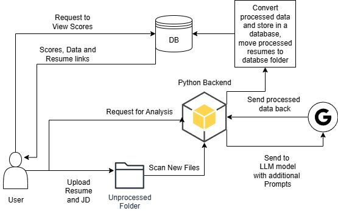

# SmartResumeScreener
A Demo for Smart Resume Screener task.

Current Implementation supports Gemini API in the backend.

## Arhitecture:
- The application is divided into smaller microservices files for simplicity.
- Currently, a basic demo is set up using Gradio for frontend.
- The data is stored in a simple csv files, however it is a drop in replacement as pandas supports SQL inferencing, or DuckDB can also be utilised with ODBC connectors.
- Currently, uploaded PDF resumes are stored in by the application. 
- Additional implementation for using a Local VLM/LLM model also exists, but isn't being actively used for demonstration purposes and lack of resources. A 7B parameter model requires atleast 8 Gb of RAM.
- Parsing speed depends on the backend model (Gemini 2.5 Flash).

The API key must be stored in a `.env` file with key `GEMINI_API_KEY`.

When the app is running, the uploaded resumes are saved to a folder.
A script runs to mark the files to be parsed.\
The files are uploaded and analysed by Model one-by-one. The data is inserted into the database file. Once a file is parsed, it can be moved to a different folder.\
The data is displayed as a HTML table in Descending order of scores achieved.

## Prompts
A major limitation that the model may face while performing this task is lack of context window and output token limit per chat.\
Gemini Models support 1 Million context window with 16K output tokens, so we can use it.
The open source models that support such long windows are limited and often heavy for running locally.

For prompting, I have used a simple JSON schema structure to force the output to be in a specific format.\
> JSON Schema = {\
    "name": string,\
    "score":number,\
    summary:string\
    ...\
}

For the model, we can assume roleplay by prompting something like:
> You are an expert HR recruiter ...\
> Here is the Job description {JD} ...\
> Here is how you should structure your answer {JSON Schema} ...\
> Be professional ,avoid markdown, ...

The output can be then post-processed, augmented and interted into the database.

## Run
To run, navigate to the directory where the files are cloned. Type

`python Main.py`

it will open the Demo on localhost

### [Demo Video Link]()

Thank you.
